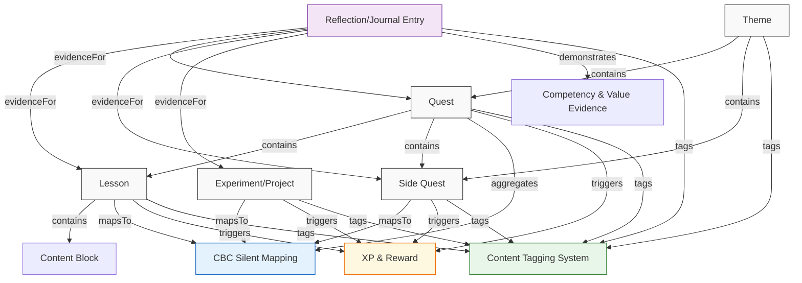

# SECTION 4 — CONTENT ENGINE SCHEMAS

This document defines the core data structures that power the Arizen Homeschool content engine. These schemas are production‑grade, include explicit data types, example values, and inline comments explaining each field’s purpose.

---

## 1. Lesson Object Schema

A lesson is the atomic unit of instruction. It may contain multiple content blocks and is mapped silently to the CBC curriculum.

```json
{
  "lessonId": "string (UUID)",                           // Unique identifier for the lesson
  "themeId": "string (UUID)",                            // FK to Theme this lesson belongs to
  "questId": "string (UUID, nullable)",                  // FK to Quest (if part of a quest)
  "title": "string",                                     // Human‑readable title shown to learners
  "description": "string",                               // Short synopsis of the lesson purpose
  "contentBlocks": [                                     // Ordered array of instructional media
    {
      "type": "enum(text, video, audio, image, interactive)", // Media type
      "url": "string (nullable)",                           // External or hosted asset URL
      "embedCode": "string (nullable)",                     // For iframe/interactive embeds
      "caption": "string (nullable)",                       // Accessibility caption / alt text
      "durationSeconds": "number (nullable)",               // For timed media (video/audio)
      "transcript": "string (nullable)",                    // Text transcript for accessibility
      "interactiveData": "object (nullable)"                // Payload for interactive blocks (e.g., quiz config)
    }
  ],
  "cbcMapping": {                                          // Silent CBC alignment (not shown to learners)
    "subject": "enum(Mathematics, Science_and_Technology, English, Kiswahili, Social_Studies, Creative_Arts, Life_Skills, Religious_Education)",
    "strand": "string",                                   // e.g., "Numbers" within Mathematics
    "subStrand": "string",                                // e.g., "Whole Numbers"
    "specificLearningOutcome": "string",                  // Official CBC SLO code/description
    "coreCompetencies": [                                 // 0‑7 of the CBC competencies demonstrated
      "enum(critical_thinking, problem_solving, creativity, communication, collaboration, citizenship, self_efficacy, digital_literacy, learning_to_learn)"
    ],
    "coreValues": [                                       // 0‑8 of the CBC values cultivated
      "enum(love, responsibility, respect, unity, peace, patriotism, integrity, social_justice)"
    ],
    "pertinentContemporaryIssues": [                      // 0‑N PCIs addressed
      "enum(environmental_education, disaster_risk_reduction, financial_literacy, hiv_aids, gender_equality, moral_values, drug_abuse, peace_education)"
    ]
  },
  "difficulty": {                                         // Multidimensional difficulty rating
    "cognitiveLevel": "enum(remember, understand, apply, analyze, evaluate, create)", // Bloom's
    "complexityScore": "number (1‑5)",                    // Overall difficulty (1 = easy, 5 = hard)
    "prerequisiteLoad": "number (0‑5)",                   // Cognitive load of prerequisites
    "abstractness": "number (1‑5)"                        // How abstract/concrete the concepts are
  },
  "estimatedDurationMinutes": "number (5‑120)",           // Suggested time on task
  "xpReward": {                                           // XP awarded upon mastery demonstration
    "base": "number (0‑500)",                             // Base XP for completion
    "competencyBonus": "object",                          // Extra XP per competency demonstrated (see XP & Reward Metadata)
    "valueBonus": "object",                               // Extra XP per value demonstrated
    "streakEligible": "boolean"                           // Can this lesson contribute to a streak?
  },
  "prerequisites": [                                      // Array of lesson/skill IDs that must be mastered first
    {
      "lessonId": "string (UUID)",
      "masteryThreshold": "number (0‑100)"                // Minimum mastery % required (e.g., 80)
    }
  ],
  "masteryCriteria": [                                    // Observable indicators of lesson mastery
    "string"                                              // e.g., "Can multiply a 3‑digit by a 2‑digit number with 90% accuracy"
  ],
  "adaptations": {                                        // Personalization flags
    "languageSupport": ["enum(en, sw)"],                  // Available languages
    "sensoryOptions": ["enum(text_only, audio_visual, tactile)"], // Modalities offered
    "pacing": "enum(self_paced, guided)",                 // Learner control over speed
    "difficultyAdjustment": "boolean"                     // Whether AI can adjust difficulty in‑real‑time
  },
  "tags": [                                               // See Content Tagging System taxonomy
    "string"
  ],
  "aiGeneration": {                                       // Flags which fields can be AI‑generated
    "title": "boolean",
    "description": "boolean",
    "contentBlocks": "boolean",
    "cbcMapping": "boolean",                              // Usually human‑reviewed but can be suggested
    "difficulty": "boolean",
    "estimatedDurationMinutes": "boolean",
    "xpReward.base": "boolean",
    "prerequisites": "boolean",
    "masteryCriteria": "boolean",
    "adaptations": "boolean",
    "tags": "boolean"
  },
  "version": {                                            // Content versioning
    "createdAt": "string (ISO‑8601 timestamp)",
    "updatedAt": "string (ISO‑8601 timestamp)",
    "createdBy": "string (userId or 'ai')",
    "reviewedBy": "string (userId, nullable)",
    "versionNumber": "string (semver)",
    "changeLog": "string"
  }
}
```

---

## 2. Quest Object Schema

A quest groups multiple lessons and side‑quests into a coherent learning arc that drives toward a theme‑level outcome.

```json
{
  "questId": "string (UUID)",
  "themeId": "string (UUID)",                            // Parent theme
  "title": "string",
  "description": "string",                               // Narrative hook or driving question for the quest
  "questType": "enum(main, side, challenge)",            // Main quest = core learning arc
  "orderIndex": "number",                                // Sequence within the theme (0‑based)
  "lessons": [                                           // Ordered list of lesson IDs
    {
      "lessonId": "string (UUID)",
      "isRequired": "boolean",                           // Optional lessons can be skipped
      "unlockCondition": "string (nullable)"             // e.g., "complete lesson X with mastery >=80%"
    }
  ],
  "sideQuests": [                                        // Refer to Side Quest Structure
    {
      "sideQuestId": "string (UUID)",
      "isOptional": "boolean"
    }
  ],
  "cbcMapping": {                                        // Aggregated CBC mapping for the quest
    "subjects": ["string"],                              // Unique subjects covered
    "strands": ["string"],
    "subStrands": ["string"],
    "specificLearningOutcomes": ["string"],
    "coreCompetencies": ["string"],
    "coreValues": ["string"],
    "pertinentContemporaryIssues": ["string"]
  },
  "estimatedDurationMinutes": "number",                  // Sum of lesson durations + buffers
  "xpReward": {                                          // XP for completing the entire quest
    "base": "number (0‑2000)",
    "competencyBonus": "object",
    "valueBonus": "object",
    "completionBonus": "number (0‑500)"                  // Extra XP for finishing all required lessons
  },
  "prerequisiteQuests": [                                // Quests that must be completed first
    {
      "questId": "string (UUID)",
      "masteryThreshold": "number (0‑100)"
    }
  ],
  "masteryCriteria": [                                   // Quest‑level mastery indicators
    "string"
  ],
  "tags": [                                              // See Content Tagging System
    "string"
  ],
  "aiGeneration": {
    "title": "boolean",
    "description": "boolean",
    "questType": "boolean",
    "lessons": "boolean",
    "sideQuests": "boolean",
    "cbcMapping": "boolean",
    "estimatedDurationMinutes": "boolean",
    "xpReward": "boolean",
    "prerequisiteQuests": "boolean",
    "masteryCriteria": "boolean",
    "tags": "boolean"
  },
  "version": {                                           // Same structure as Lesson.version
    "createdAt": "string (ISO‑8601 timestamp)",
    "updatedAt": "string (ISO‑8601 timestamp)",
    "createdBy": "string",
    "reviewedBy": "string (nullable)",
    "versionNumber": "string (semver)",
    "changeLog": "string"
  }
}
```

---

## 3. Side Quest Structure

Side quests are optional enrichment activities that deepen understanding, provide real‑world application, or cater to interests.

```json
{
  "sideQuestId": "string (UUID)",
  "questId": "string (UUID, nullable)",                  // Parent quest (if any) or theme directly
  "themeId": "string (UUID)",                            // Owning theme
  "title": "string",
  "description": "string",
  "sideQuestType": "enum(experiment, journaling, realWorldTask, drawing, building, interview, fieldTrip, game, puzzle)",
  "activityBlocks": [                                    // Similar to Lesson.contentBlocks but focused on doing
    {
      "type": "enum(text, video, audio, image, interactive, checklist, timer)",
      "url": "string (nullable)",
      "embedCode": "string (nullable)",
      "caption": "string (nullable)",
      "durationSeconds": "number (nullable)",
      "transcript": "string (nullable)",
      "interactiveData": "object (nullable)"
    }
  ],
  "cbcMapping": {                                        // May map to multiple subjects/competencies
    "subjects": ["string"],
    "strands": ["string"],
    "subStrands": ["string"],
    "specificLearningOutcomes": ["string"],
    "coreCompetencies": ["string"],
    "coreValues": ["string"],
    "pertinentContemporaryIssues": ["string"]
  },
  "difficulty": {                                        // Same structure as Lesson.difficulty
    "cognitiveLevel": "enum(remember, understand, apply, analyze, evaluate, create)",
    "complexityScore": "number (1‑5)",
    "prerequisiteLoad": "number (0‑5)",
    "abstractness": "number (1‑5)"
  },
  "estimatedDurationMinutes": "number (5‑180)",
  "xpReward": {                                          // XP awarded on completion
    "base": "number (0‑800)",
    "competencyBonus": "object",
    "valueBonus": "object",
    "streakEligible": "boolean"
  },
  "prerequisites": [                                     // Lesson or skill IDs required before starting
    {
      "lessonId": "string (UUID)",
      "masteryThreshold": "number (0‑100)"
    }
  ],
  "completionCriteria": [                                // Observable evidence that side quest is done
    "string"                                             // e.g., "Submitted a labeled diagram of the water cycle"
  ],
  "evidenceUpload": {                                    // Fields for student‑submitted proof
    "allowedTypes": ["enum(image, pdf, video, audio, text)"],
    "maxFileSizeMB": "number (10)",
    "required": "boolean",
    "descriptionPrompt": "string (nullable)"             // Prompt shown to student when uploading
  },
  "adaptations": {                                       // Personalization options
    "languageSupport": ["enum(en, sw)"],
    "sensoryOptions": ["enum(text_only, audio_visual, tactile)"],
    "pacing": "enum(self_paced, guided)",
    "difficultyAdjustment": "boolean"
  },
  "tags": [                                              // See Content Tagging System
    "string"
  ],
  "aiGeneration": {
    "title": "boolean",
    "description": "boolean",
    "sideQuestType": "boolean",
    "activityBlocks": "boolean",
    "cbcMapping": "boolean",
    "difficulty": "boolean",
    "estimatedDurationMinutes": "boolean",
    "xpReward": "boolean",
    "prerequisites": "boolean",
    "completionCriteria": "boolean",
    "evidenceUpload": "boolean",
    "adaptations": "boolean",
    "tags": "boolean"
  },
  "version": {                                           // Same as Lesson.version
    "createdAt": "string (ISO‑8601 timestamp)",
    "updatedAt": "string (ISO‑8601 timestamp)",
    "createdBy": "string",
    "reviewedBy": "string (nullable)",
    "versionNumber": "string (semver)",
    "changeLog": "string"
  }
}
```

---

## 4. Reflection/Journal Entry Structure

Captures student reflections, self‑assessments, and competency evidence linked to lessons, quests, or side quests.

```json
{
  "entryId": "string (UUID)",
  "studentId": "string (UUID)",                          // FK to learner
  "lessonId": "string (UUID, nullable)",                 // Associated lesson (if any)
  "questId": "string (UUID, nullable)",                  // Associated quest (if any)
  "sideQuestId": "string (UUID, nullable)",              // Associated side quest (if any)
  "themeId": "string (UUID, nullable)",                  // Direct theme link (if not tied to lower item)
  "timestamp": "string (ISO‑8601 timestamp)",
  "entryType": "enum(reflection, journal, selfAssessment, goalSetting, peerFeedback)",
  "prompt": "string (nullable)",                         // Teacher‑ or system‑provided prompt
  "response": {                                          // Student’s answer – can be multi‑modal
    "text": "string (nullable)",
    "audioUrl": "string (nullable)",
    "imageUrl": "string (nullable)",
    "videoUrl": "string (nullable)",
    "fileUrl": "string (nullable)"                       // Generic attachment
  },
  "competencyEvidence": [                                // Which competencies the entry demonstrates
    {
      "competency": "enum(critical_thinking, problem_solving, creativity, communication, collaboration, citizenship, self_efficacy, digital_literacy, learning_to_learn)",
      "evidenceDescription": "string",                   // Short note on how the response shows the competency
      "rating": "number (1‑5)"                            // Self‑ or teacher‑rated proficiency (1 = emerging, 5 = exemplary)
    }
  ],
  "valueEvidence": [                                     // Which values the entry reflects
    {
      "value": "enum(love, responsibility, respect, unity, peace, patriotism, integrity, social_justice)",
      "evidenceDescription": "string",
      "rating": "number (1‑5)"
    }
  ],
  "pciEvidence": [                                       // Pertinent contemporary issues touched
    {
      "pci": "enum(environmental_education, disaster_risk_reduction, financial_literacy, hiv_aids, gender_equality, moral_values, drug_abuse, peace_education)",
      "evidenceDescription": "string"
    }
  ],
  "tags": [                                              // See Content Tagging System (auto‑suggested from linked content)
    "string"
  ],
  "aiGeneration": {                                      // Which fields can be AI‑generated (e.g., prompts, tags)
    "prompt": "boolean",
    "response": "boolean",                               // AI can suggest improvements, not generate student voice
    "competencyEvidence": "boolean",
    "valueEvidence": "boolean",
    "pciEvidence": "boolean",
    "tags": "boolean"
  },
  "version": {                                           // Same as Lesson.version
    "createdAt": "string (ISO‑8601 timestamp)",
    "updatedAt": "string (ISO‑8601 timestamp)",
    "createdBy": "string",                               // studentId
    "reviewedBy": "string (nullable)",                   // teacherId or parentId
    "versionNumber": "string (semver)",
    "changeLog": "string"
  }
}
```

---

## 5. Experiment/Project Structure

Supports offline or hybrid hands‑on activities, with materials, procedures, and evidence capture.

```json
{
  "activityId": "string (UUID)",                         // Unique ID (can be used as lesson.sideQuestId etc.)
  "lessonId": "string (UUID, nullable)",                 // If part of a lesson
  "questId": "string (UUID, nullable)",                  // If part of a quest
  "sideQuestId": "string (UUID, nullable)",              // If a stand‑alone side quest
  "themeId": "string (UUID)",                            // Owning theme
  "title": "string",
  "description": "string",
  "activityType": "enum(experiment, project, build, model, cooking, fieldStudy, survey)",
  "materialsList": [                                     // Items needed; quantities and notes
    {
      "item": "string",
      "quantity": "string (nullable)",                   // e.g., "2 cups", "1 piece"
      "unit": "enum(piece, gram, ml, cup, tsp, tbsp, pack, bottle)",
      "notes": "string (nullable)",                      // e.g., "food‑coloring, blue"
      "isOptional": "boolean",
      "safetyWarning": "string (nullable)"               // e.g., "Adult supervision required"
    }
  ],
  "toolsList": [                                         // Reusable equipment (scissors, ruler, etc.)
    {
      "tool": "string",
      "quantity": "number",
      "notes": "string (nullable)"
    }
  ],
  "procedureSteps": [                                    // Ordered steps to follow
    {
      "stepNumber": "number",
      "description": "string",
      "durationMinutes": "number (nullable)",
      "safetyNote": "string (nullable)",
      "media": [                                         // Optional photos/video per step
        {
          "type": "enum(image, video)",
          "url": "string",
          "caption": "string (nullable)"
        }
      ]
    }
  ],
  "estimatedDurationMinutes": "number (5‑240)",
  "difficulty": {                                        // Same as Lesson.difficulty
    "cognitiveLevel": "enum(remember, understand, apply, analyze, evaluate, create)",
    "complexityScore": "number (1‑5)",
    "prerequisiteLoad": "number (0‑5)",
    "abstractness": "number (1‑5)"
  },
  "cbcMapping": {                                        // Silent CBC alignment
    "subjects": ["string"],
    "strands": ["string"],
    "subStrands": ["string"],
    "specificLearningOutcomes": ["string"],
    "coreCompetencies": ["string"],
    "coreValues": ["string"],
    "pertinentContemporaryIssues": ["string"]
  },
  "xpReward": {                                          // XP on successful completion & evidence upload
    "base": "number (0‑1200)",
    "competencyBonus": "object",
    "valueBonus": "object",
    "streakEligible": "boolean"
  },
  "prerequisites": [                                     // Lesson/skill IDs needed before starting
    {
      "lessonId": "string (UUID)",
      "masteryThreshold": "number (0‑100)"
    }
  ],
  "completionCriteria": [                                // Observable evidence that activity is done
    "string"                                             // e.g., "Submitted a working rain gauge with calibration notes"
  ],
  "evidenceUpload": {                                    // Student‑submitted proof of completion
    "required": "boolean",
    "allowedTypes": ["enum(image, pdf, video, audio, text)"],
    "maxFileSizeMB": "number (15)",
    "descriptionPrompt": "string (nullable)",
    "annotationFields": [                                // Optional fields student fills when uploading
      {
        "name": "string",
        "type": "enum(text, number, date, checkbox)",
        "placeholder": "string (nullable)",
        "required": "boolean"
      }
    ]
  },
  "adaptations": {                                       // Personalization & accessibility
    "languageSupport": ["enum(en, sw)"],
    "sensoryOptions": ["enum(text_only, audio_visual, tactile)"],
    "pacing": "enum(self_paced, guided)",
    "difficultyAdjustment": "boolean",
    "supportLevel": "enum(independent, partnered, guided)" // How much adult help is expected
  },
  "tags": [                                              // See Content Tagging System
    "string"
  ],
  "aiGeneration": {
    "title": "boolean",
    "description": "boolean",
    "activityType": "boolean",
    "materialsList": "boolean",
    "toolsList": "boolean",
    "procedureSteps": "boolean",
    "estimatedDurationMinutes": "boolean",
    "difficulty": "boolean",
    "cbcMapping": "boolean",
    "xpReward": "boolean",
    "prerequisites": "boolean",
    "completionCriteria": "boolean",
    "evidenceUpload": "boolean",
    "adaptations": "boolean",
    "tags": "boolean"
  },
  "version": {                                           // Same as Lesson.version
    "createdAt": "string (ISO‑8601 timestamp)",
    "updatedAt": "string (ISO‑8601 timestamp)",
    "createdBy": "string",
    "reviewedBy": "string (nullable)",
    "versionNumber": "string (semver)",
    "changeLog": "string"
  }
}
```

---

## 6. XP & Reward Metadata Schema

Ensures XP awards are traceable to demonstrated competencies and values, not just task completion.

```json
{
  "xpRuleId": "string (UUID)",                           // Unique identifier for the XP rule
  "scope": "enum(lesson, quest, sideQuest, experiment, reflection)", // What the rule applies to
  "baseXP": "number (0‑2000)",                           // Base XP awarded for completing the scope item
  "competencyMultipliers": {                             // XP added per demonstrated competency
    "critical_thinking": "number (0‑50)",
    "problem_solving": "number (0‑50)",
    "creativity": "number (0‑50)",
    "communication": "number (0‑50)",
    "collaboration": "number (0‑50)",
    "citizenship": "number (0‑50)",
    "self_efficacy": "number (0‑50)",
    "digital_literacy": "number (0‑50)",
    "learning_to_learn": "number (0‑50)"
  },
  "valueMultipliers": {                                  // XP added per demonstrated value
    "love": "number (0‑30)",
    "responsibility": "number (0‑30)",
    "respect": "number (0‑30)",
    "unity": "number (0‑30)",
    "peace": "number (0‑30)",
    "patriotism": "number (0‑30)",
    "integrity": "number (0‑30)",
    "social_justice": "number (0‑30)"
  },
  "pciMultipliers": {                                    // Optional bonus for engaging PCIs
    "environmental_education": "number (0‑20)",
    "disaster_risk_reduction": "number (0‑20)",
    "financial_literacy": "number (0‑20)",
    "hiv_aids": "number (0‑20)",
    "gender_equality": "number (0‑20)",
    "moral_values": "number (0‑20)",
    "drug_abuse": "number (0‑20)",
    "peace_education": "number (0‑20)"
  },
  "streakBonus": {                                       // Additional XP if part of an active streak
    "enabled": "boolean",
    "bonusXP": "number (0‑100)",
    "streakLengthRequired": "number (1‑30)"             // e.g., 3‑day streak triggers bonus
  },
  "masteryThreshold": "number (0‑100)",                  // Minimum mastery % to earn any XP (e.g., 80)
  "partialXPRatio": "number (0‑1)",                      // XP awarded if mastery < threshold but >0 (e.g., 0.5 = half base XP)
  "aiGeneration": {                                      // Which parts can be AI‑suggested (usually human‑finalized)
    "baseXP": "boolean",
    "competencyMultipliers": "boolean",
    "valueMultipliers": "boolean",
    "pciMultipliers": "boolean",
    "streakBonus": "boolean",
    "masteryThreshold": "boolean",
    "partialXPRatio": "boolean"
  },
  "version": {                                           // Same as Lesson.version
    "createdAt": "string (ISO‑8601 timestamp)",
    "updatedAt": "string (ISO‑8601 timestamp)",
    "createdBy": "string",
    "reviewedBy": "string (nullable)",
    "versionNumber": "string (semver)",
    "changeLog": "string"
  }
}
```

*Note: When calculating total XP for an item, the engine sums `baseXP` + (sum of applicable `competencyMultipliers` × demonstrated competency count) + (sum of applicable `valueMultipliers` × demonstrated value count) + any applicable streak or PCI bonuses, then applies the mastery threshold/partial ratio.*

---

## 7. Content Tagging System – Taxonomy

A controlled vocabulary used across all objects for discoverability, analytics, and AI‑driven recommendations.

```json
{
  "tagTaxonomy": {
    "theme": [                                          // High‑level learning themes
      "water_rivers", "seasons_weather", "food_farming", "energy_machines", "weather_climate",
      "local_plants_animals", "community_helpers", "my_body_health", "numbers_patterns",
      "shapes_space", "sound_light", "forces_motion", "earth_space", "cultures_traditions"
    ],
    "domain": [                                         // Broad knowledge areas (aligns with CBC subjects)
      "mathematics", "science", "english", "kiswahili", "social_studies",
      "creative_arts", "life_skills", "religious_education"
    ],
    "cbcStrand": [                                      // Example strands – extend per subject
      // Mathematics strands
      "numbers", "operations", "measurement", "geometry", "data_handling",
      // Science strands
      "living_things", "materials", "energy", "earth_and_space",
      // English strands
      "listening_speaking", "reading", "writing", "grammar",
      // Kiswahili strands
      "kusikiliza_kutumia", "kusoma", "kuandika", "sarufi",
      // Social Studies strands
      "people_and_relationships", "time_chronology", "places_environments",
      "resources_economic_activities", "governance",
      // Creative Arts strands
      "music", "art_and_craft", "physical_education",
      // Life Skills strands
      "health_education", "morals_and_values", "agriculture",
      // Religious Education strands
      "christian_religious_education", "islamic_religious_education", "hindu_religious_education"
    ],
    "competency": [                                     // 9 CBC core competencies
      "critical_thinking", "problem_solving", "creativity",
      "communication", "collaboration", "citizenship",
      "self_efficacy", "digital_literacy", "learning_to_learn"
    ],
    "value": [                                          // 8 CBC core values
      "love", "responsibility", "respect", "unity",
      "peace", "patriotism", "integrity", "social_justice"
    ],
    "pci": [                                            // Pertinent & Contemporary Issues (examples)
      "environmental_education", "disaster_risk_reduction", "financial_literacy",
      "hiv_aids", "gender_equality", "moral_values", "drug_abuse", "peace_education"
    ],
    "activityType": [                                   // Types of learning experiences
      "lesson", "experiment", "project", "journaling", "reflection",
      "fieldTrip", "interview", "building", "drawing", "cooking",
      "survey", "game", "puzzle", "simulation", "rolePlay"
    ],
    "modality": [                                       // How content is consumed/produced
      "text", "audio", "video", "image", "interactive",
      "hands_on", "kinesthetic", "collaborative", "self_paced"
    ],
    "difficultyLabel": [                                // Human‑readable difficulty bands
      "beginner", "developing", "proficient", "advanced", "expert"
    ],
    "language": [                                       // Supported languages
      "en", "sw"
    ]
  },
  "usageNotes": "Tags are stored as strings in the `tags` array of each object. Multiple taxonomies can coexist (e.g., a lesson may have tags: ['water_rivers', 'science', 'earth_and_space', 'critical_thinking', 'responsibility', 'environmental_education', 'experiment', 'hands_on', 'en']).",
  "aiGeneration": {
    "suggestTags": "boolean"                            // AI can propose tags based on content; final approval by curator
  }
}
```

---

## 8. Difficulty Scaling System

Defines how difficulty is measured, stored, and adapted per learner profile.

```json
{
  "difficultyModel": {
    "dimensions": [
      {
        "name": "cognitiveLevel",
        "description": "Bloom’s taxonomy level of thinking required",
        "scale": {
          "type": "ordinal",
          "values": ["remember", "understand", "apply", "analyze", "evaluate", "create"],
          "mapping": { "remember": 1, "understand": 2, "apply": 3, "analyze": 4, "evaluate": 5, "create": 6 }
        }
      },
      {
        "name": "complexityScore",
        "description": "Overall cognitive load (number of concepts, steps, abstractions)",
        "scale": {
          "type": "interval",
          "range": [1, 5],
          "granularity": 0.5
        }
      },
      {
        "name": "prerequisiteLoad",
        "description": "Cognitive load imposed by required prior knowledge",
        "scale": {
          "type": "interval",
          "range": [0, 5],
          "granularity": 0.5
        }
      },
      {
        "name": "abstractness",
        "description": "Degree to which ideas are concrete vs. abstract",
        "scale": {
          "type": "interval",
          "range": [1, 5],
          "granularity": 0.5
        }
      }
    ],
    "aggregation": {
      "method": "weightedSum",
      "weights": {
        "cognitiveLevel": 0.35,
        "complexityScore": 0.30,
        "prerequisiteLoad": 0.20,
        "abstractness": 0.15
      },
      "finalScoreRange": [0, 100],
      "bands": [
        { "range": [0, 20], "label": "beginner" },
        { "range": (20, 40], "label": "developing" },
        { "range": (40, 60], "label": "proficient" },
        { "range": (60, 80], "label": "advanced" },
        { "range": (80, 100], "label": "expert" }
      ]
    }
  },
  "learnerProfile": {
    "masteryMap": {                                      // topicId -> mastery % (0‑100)
      "string": "number"
    },
    "preferredPace": "enum(self_paced, guided)",
    "sensoryPreferences": ["enum(text_only, audio_visual, tactile)"],
    "language": "enum(en, sw)",
    "zoneOfProximalDevelopment": {                       // Calculated estimate of next challenge level
      "minDifficulty": "number (0‑100)",
      "maxDifficulty": "number (0‑100)",
      "confidence": "number (0‑1)"                      // How sure we are of the estimate
    }
  },
  "adaptationRules": [
    {
      "if": "learner.masteryMap[topic] >= 80",
      "then": "increase difficulty by 1 band (if available)",
      "confidence": "high"
    },
    {
      "if": "learner.masteryMap[topic] < 50",
      "then": "decrease difficulty by 1 band (if available) or provide scaffolding",
      "confidence": "high"
    },
    {
      "if": "learner.preferredPace == 'self_paced'",
      "then": "allow learner to adjust speed; provide optional challenge extensions",
      "confidence": "medium"
    }
  ],
  "aiGeneration": {
    "suggestDifficultyAdjustment": "boolean",           // AI can propose difficulty tweaks based on performance
    "predictMastery": "boolean"                         // AI can forecast mastery from interaction data
  }
}
```

---

## 9. AI Generation Compatibility Fields

Each schema includes an `aiGeneration` object (shown in the examples above) that flags which fields can be auto‑generated by AI versus those that require human authorship or review.

**General Guidelines:**

- **AI‑generatable fields:** Titles, descriptions, content blocks (text/audio/video URLs, interactive configs), tags, difficulty estimates, estimated durations, base XP, prerequisite lists, adaptation options, and suggested mappings.
- **Human‑required / review‑required fields:** Core CBC mapping (subject, strand, sub‑strand, SLO, competencies, values, PCIs) – AI can suggest but final sign‑off must be by a curriculum expert; mastery criteria; completion criteria; evidence upload requirements; safety notes; versioning metadata (createdBy/reviewedBy); and any fields that involve legal, safety, or cultural sensitivity.

The `aiGeneration` flag should default to `false` for sensitive fields and `true` for purely descriptive or structural fields. Curators can toggle flags per content type as needed.

---

## 10. Schema Relationship Diagram

The following Mermaid diagram illustrates how the core entities relate to each other and to the CBC mapping layer.



**Explanation of the Diagram:**

- **Themes** are top‑level containers that hold **Quests** and **Side Quests**.
- **Quests** contain **Lessons** (core learning arc) and may also contain **Side Quests**.
- **Lessons** are made of **Content Blocks** (text, video, interactive, etc.).
- Every content‑bearing object (Lesson, Quest, Side Quest, Experiment/Project) **maps to** the **CBC Silent Mapping** layer (subject, strand, SLO, competencies, values, PCIs). Quests aggregate mappings of their children.
- **XP & Reward** is triggered by completion of Lessons, Quests, Side Quests, and Experiments/Projects.
- **Reflection/Journal Entries** serve as evidence for learning and are linked to the objects they reflect upon; they also demonstrate Competency & Value evidence.
- All objects can be tagged via the **Content Tagging System** for discoverability and analytics.
- Adaptation, difficulty scaling, and AI generation fields are embedded within each schema (not shown as separate nodes for clarity).

--- 

*End of Section 4 — Content Engine Design. The file `04_content_engine_schemas.md` is now ready for implementation.* 